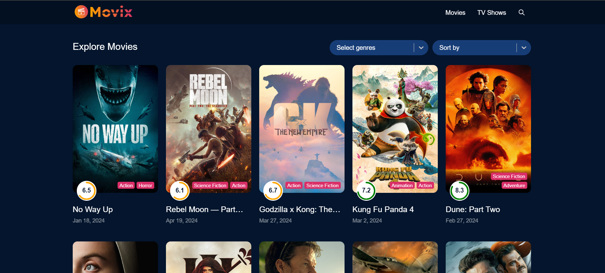

# Movix - Your Movie Recommendation Website

Movix is a movie recommendation website where you can discover trending movies, explore details about them, and watch trailers.

## Overview

Movix is built using React.js and utilizes data fetched from various APIs to provide users with up-to-date information about movies and TV shows. It offers features like browsing trending movies, searching for specific titles, exploring details of individual movies, and more.

## Features

- **Trending Movies:** Get access to a curated list of trending movies.
- **Search Functionality:** Search for movies by title or keywords.
- **Detailed Movie Information:** View detailed information about each movie, including its poster, release date, genres, and rating.
- **Watch Trailers:** Watch trailers of your favorite movies directly on the website.

## Installation

To run Movix locally on your machine, follow these steps:

1. Clone the repository:
git clone https://github.com/Shreyash-Pandey90/Movix

2. Install dependencies:
   npm install
   
4. Start the development server:
    npm start

## Technologies Used

- React.js
- React Router
- Redux
- API Integration
- HTML
- CSS

## Preview

https://movix-eta.vercel.app/

